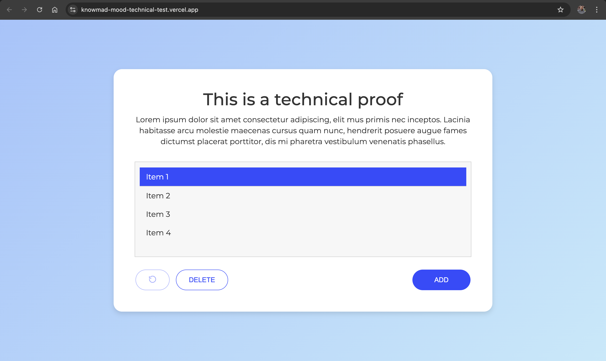

# Knowmad Mood Technical Test

Technical test developed with React + TypeScript + Vite.

The application allows users to manage a list of text items with the following features:

* Add new items
* Select and unselect items
* Delete selected items
* Delete items with double click
* Undo last action
* Responsive layout
* Pixel-perfect UI based on Adobe XD design

---

# Live Demo

https://knowmad-mood-technical-test.vercel.app/

---

# Preview



---

## Demo Video

[Watch demo video](./public/demo.mov)

---

# Technologies Used

* React
* TypeScript
* Vite
* CSS3
* Vitest
* React Testing Library
* Playwright

---

# Getting Started

## Install dependencies

```bash
npm install
```

## Run development server

```bash
npm run dev
```

## Build project

```bash
npm run build
```

# Testing

## Run unit tests

```bash
npm run test
```

## Run E2E tests

```bash
npm run test:e2e
```

## Run E2E tests in headed mode
```bash
npm run test:e2e -- --headed
```

---

# Features

## Add items

Users can open a modal and add new text items to the list.

Validation included:

* Empty values are not allowed
* Leading and trailing spaces are trimmed

Extra UX:

* Press `Enter` to add item
* Press `Escape` to close modal

---

## Select items

Items can be selected and unselected by clicking on them.

---

## Delete selected items

The DELETE button removes all selected items.

The button is automatically disabled when no item is selected.

---

## Double click delete

Users can remove individual items by double clicking them.

---

## Undo last action

The refresh button restores the previous list state.

Supported actions:

* Add item
* Delete selected items
* Double click delete

---

# Project Structure

```txt
src/
├── __tests__/
│   └── App.test.tsx
│
├── components/
│   ├── AddItemModal.tsx
│   ├── InputBar.tsx
│   ├── ItemList.tsx
│   └── ListItem.tsx
│
├── test/
│   └── setup.ts
│
├── types/
│   ├── text-item.ts
│   └── component-props.ts
│
├── App.tsx
├── App.css
├── main.tsx
└── index.css

e2e/
└── app.spec.ts
```

---

# UI Notes

The UI was implemented following the Adobe XD design provided in the technical test: https://xd.adobe.com/view/ea696dd0-8781-4460-8720-36deb2d19b2a-bf3a/

Implemented details:

* Linear gradient background
* Rounded cards and buttons
* Smooth modal animations
* Responsive behavior
* Typography and spacing adjustments
* Disabled states
* Hover-ready structure

---

# Responsive Design

The layout adapts to smaller screen sizes while preserving the original desktop design.

Responsive adjustments include:

* Flexible card width
* Adaptive modal sizing
* Mobile spacing improvements
* Preventing horizontal overflow

---

# Accessibility & UX

Implemented improvements:

* Disabled button states
* Keyboard shortcuts
* Semantic buttons
* Focus-friendly inputs
* Smooth modal transitions

---

# Test Coverage

The project includes both unit/integration tests and end-to-end tests.

Covered scenarios:

* Initial item rendering
* Add new item flow
* Empty input validation
* Delete selected items
* Double click delete
* Undo functionality
* Modal interactions

# Author

Kevin Abreu
